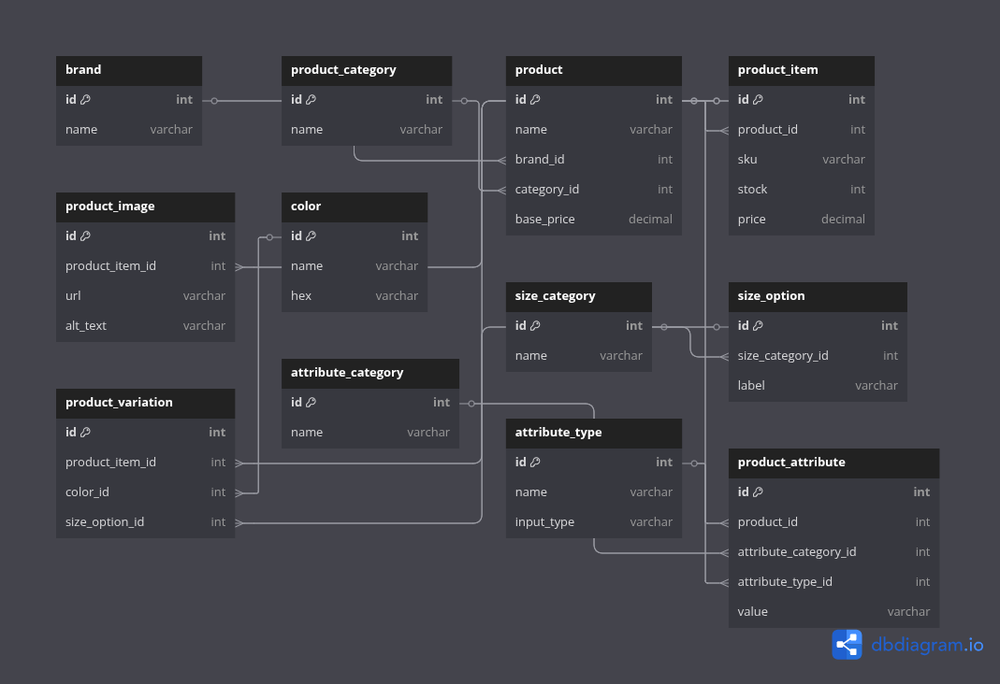

# 🛍️ E-commerce Database Design

#📘 Project Summary
This project is a  implementation of an e-commerce database schema, designed to strengthen practical skills in data modeling, SQL, and database architecture. It involves creating an Entity-Relationship Diagram (ERD), defining the structure using SQL, and ensuring relational integrity across multiple interconnected tables that simulate a real-world e-commerce system.


## 🛠️ Tools Used
- MySQL / SQLite
- dbdiagram.io (for ERD)
- draw.io (alternative for diagram)
- Git & GitHub (for version control)

## 📄 Files Included
- `ecommerce.sql`: Full SQL script to create all tables and constraints
- `erd.png`: Exported ERD image
- `ecommerce.dbml`: DBML file used in dbdiagram.io (database schema)


## 🗂️ Tables Designed
- `product`
- `product_item`
- `product_category`
- `brand`
- `product_image`
- `color`
- `product_variation`
- `size_category`
- `size_option`
- `product_attribute`
- `attribute_category`
- `attribute_type`

## 🔁 Data Flow
We designed the relationships to reflect a typical e-commerce platform:
- Products belong to categories and brands.
- Each product has multiple variations (e.g., size & color).
- Images and attributes are stored per item or variation.

## 🖼️ ER Diagram


## 🚀 How to Run the SQL
1. Install MySQL or use [sqlite3](https://sqlite.org/download.html) or [rusqlite](https://crates.io/crates/rusqlite).
2. Import the SQL script:
   ```bash
   sqlite3 ecommerce.db < ecommerce.sql
